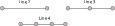

# FEM in one dimension

In Rayleigh-Ritz method the basis functions are analytical functions defined on the entire solution domain. In FEM, the computation domain $[0,L]$ is divided into small line elements.  These line elements can be linear (Line2),  quadratic (Line3), cubic (Line4), and so on. A Line2 element consists 2 nodes, Line3 element consists 3 nodes. 

The basis functions are defined over these finite element, therefore, these functions are local in nature (compact). These basis functions are not uniformly zero over atmost two elements. 

{#fig-line-element}

## Notations

- Mesh is a collection of finite elements. The total number of elements inside the mesh will be denoted by $N_{elem}$. 
- The total number of nodes in the mesh is denoted by $N_{node}$.  They are numbered from 1 to $N_{node}$. 
- We will use $e$ in the superscript or subscript to denote the $e=1,\cdots,N_{elem}$ of the mesh. 
- We will denote the discretize computation domain by $\Omega$, and the element domain by $\Omega_{e}$ 
- The nodes of an elements are numbered locally from 1, 2, to $N_{ns}$, where $N_{ns}$ is the number of node in spatial finite element. There is mapping between local node numbers and the global node numbers. So, the global node numbers are denoted by $n_{1},n_{2},\cdots,n_{ns}$. We will use $I,J$ to denote the node number.
- The shape function of $I$th node will be denoted by $N^I$, where I is the global node. The shape function of $I$th local node in an element $e$ will be denoted by $N_{e}^{I}$. We will interchangeably used $N^I$ and $N^I_{e}$. 
- We will denote $u_{I}$ as the value of $u$ at the Ith global node. We will use $u_{I}^{e}$ to denote the value of $u$ inside element $e$ at the Ith local node.
- We will denote the finite element approximation by $u^h(x)$. The restriction of $u^h(x)$ inside an element $e$ will be denoted by $u^h_{e}$.

## Finite elements

The spatial domain of finite element is given by $\Omega_{e}:=(x_{e},x_{e+1})$, and the domain of reference element is denoted by $\hat{\Omega}:=(-1,1)$. The coordinates in physical and reference elements are denoted by $x$ and $\xi$, respectively. We defined the following mapping between the reference element and the physical element. 

{#fig-mapping-line-element}

$$
x(\xi) = \frac{1-\xi}{2}x_{e}+\frac{1+\xi}{2}x_{e+1},\forall \xi \in \hat{\Omega}
$$

It can be seen that $x_{e}=x(-1)$ and $x_{e+1}=x(+1)$.

In this case we can also define the inverse mapping as:

$$
\xi = \frac{2x-x_{e}-x_{e+1}}{x_{e+1}-x_{e}}\forall x\in\Omega_{e}
$$

## Shape function based on Lagrange polynomials

Let us denote the location of nodes of reference line element by $\xi_{I},I=1,{p+1}$, where $p$ is the order of polynomial. Also note that $\xi_{1}=-1$ and $\xi_{2}=+1$ as shown in Figure below.

{#fig-reference-lagrange-element-line}

The Lagrange polynomial is given by

$$
N^{I}(\xi)=\prod_{J=1,J\ne I}^{p+1}\frac{\xi-\xi_{J}}{\xi_{I}-\xi_{J}},I=1,2,\cdots p+1,\forall\xi\in\hat{\Omega}
$$

It can be seen that $N^I(\xi_{J})=\delta_{IJ}$.

### Linear shape function

$$
N_{1}=\frac{1-\xi}{2}
$$

$$
N_{2}=\frac{1+\xi}{2}
$$

### Quadratic Lagrange shape functions

$$
N_{1}=\frac{\xi-1}{-1-1}\frac{\xi-\xi_{3}}{-1-\xi_{3}}=\frac{\left(\xi-\xi_{3}\right)\left(\xi-1\right)}{2(1+\xi_{3})}
$$

$$
N_{2}=\frac{\xi+1}{1+1}\frac{\xi-\xi_{3}}{1-\xi_{3}}=\frac{\left(\xi-\xi_{3}\right)\left(\xi+1\right)}{2(1-\xi_{3})}
$$

$$
N_{3}=\frac{\xi+1}{\xi_{3}+1}\frac{\xi-1}{\xi_{3}-1}=\frac{\left(\xi^{2}-1\right)}{(\xi_{3}^{2}-1)}
$$

> If the nodes in reference elements are uniformly spaced then $\xi_{3}=0$ in the above expression.

### Cubic Lagrange shape functions

$$
N_{1}=\frac{\xi-1}{-1-1}\frac{\xi-\xi_{3}}{-1-\xi_{3}}\frac{\xi-\xi_{4}}{-1-\xi_{4}}=(-1)^{3}\frac{\left(\xi-1\right)\left(\xi-\xi_{3}\right)\left(\xi-\xi_{4}\right)}{2(1+\xi_{3})(1+\xi_{4})}
$$

$$
N_{2}=\frac{\xi+1}{1+1}\frac{\xi-\xi_{3}}{1-\xi_{3}}\frac{\xi-\xi_{4}}{1-\xi_{4}}=\frac{\left(\xi+1\right)\left(\xi-\xi_{3}\right)\left(\xi-\xi_{4}\right)}{2(1-\xi_{3})(1-\xi_{4})}
$$

$$
N_{3}=\frac{\xi+1}{\xi_{3}+1}\frac{\xi-1}{\xi_{3}-1}\frac{\xi-\xi_{4}}{\xi_{3}-\xi_{4}}=\frac{\left(\xi^{2}-1\right)\left(\xi-\xi_{4}\right)}{(\xi_{3}^{2}-1)\left(\xi_{3}-\xi_{4}\right)}
$$

$$
N_{4}=\frac{\xi+1}{\xi_{4}+1}\frac{\xi-1}{\xi_{4}-1}\frac{\xi-\xi_{3}}{\xi_{4}-\xi_{3}}=\frac{\left(\xi^{2}-1\right)\left(\xi-\xi_{3}\right)}{(\xi_{4}^{2}-1)\left(\xi_{4}-\xi_{3}\right)}
$$

## Hierarchic shape functions

### N1, N2

$$
N_{1}=\frac{1-\xi}{2}
$$

$$
N_{2}=\frac{1+\xi}{2}
$$

### N3

$$
N_{3}=\frac{1}{2}\sqrt{\frac{3}{2}}\left(\xi^{2}-1\right)
$$

### N4

$$
N_{4}=\frac{5}{2\sqrt{10}}\xi\left(\xi^{2}-1\right)
$$

### N5

$$
N_{5}=\frac{1}{2}\sqrt{\frac{7}{2}}\left(5\xi^{2}-1\right)\left(\xi^{2}-1\right)
$$

### Legendre polynomial based Hierarchic shape functions

$$
N_{i}=\sqrt{\frac{2i-3}{2}}\int_{-1}^{\xi}P_{i-2}(\theta)d\theta,\quad i=3,4,\cdots,p+1,p\ge2
$$

Here, $P_{i}$ are the Legendre polynomials. These shape functions have the following properties.

## Finite element matrices

In FEM the coefficient matrices are computed element by element. These coefficient matrices are called local matrices, and they are assembled to form the global matrices.

### Stiffness matrix 

$$
\int_{0}^{L}\frac{d\delta u}{dx}\nu\frac{du}{dx}dx = 
$$

### Mass matrix

## Finite element vectors

## Assembly

## Essential boundary condition

## Post-processing

