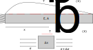

# Mathematical model in one dimension

In this chapter we will consider a simple mathematical model and demonstrate how FEM works.

## The linear elastic bar problem

Consider an elastic bar problem as shown in Figure below. The Young's modulus and the area of cross section of the bar are $E$ and $A$, respectively. $\sigma$ is  the Cauchy-stress, and $T_{b}$ is the body force per unit length in the x direction acting along the length of the bar. 

{#fig-one-d-bar}

The equilibrium equations for the bar is given by

$$
\left(\sigma+\Delta\sigma\right)\left(A+\Delta A\right)-\sigma A+T_{b}(x)\Delta x=0
$$

$$
\frac{\Delta\left(\sigma A\right)}{\Delta x}+\Delta\sigma\frac{\Delta A}{\Delta x}+T_{b}(x)=0
$$

taking $\Delta x \rightarrow 0$, and noting that 

$$
\lim_{\Delta x\rightarrow0}\frac{\Delta\sigma\Delta A}{\Delta x}=0
$$

we get 

$$
\frac{d\sigma A}{dx}+T_{b}(x)=0
$$

The Cauchy stress is given by Hooke's law of linear elasticity,

$$
\sigma = E\varepsilon_{xx}
$$

where, $\varepsilon_{xx}$ is the strain in x direction, which is given by

$$
\varepsilon_{xx}=\frac{du}{dx}
$$

where, $u(x)$ is the displacement at point $x$. Then, the governing equation becomes

$$
\frac{d}{dx}\left( AE\frac{du}{dx}\right)+T_{b}(x)=0
$$

The above equation describes the deformation of an elastic bar.

## The linear thermo-elastic bar problem

When the temperature is not uniform, then the bar may expand or contracts depending upon the increase or decrease of the temperature around a point. In such situations, the total elastic strain in the bar is given by

$$
\varepsilon_{xx}=\frac{du}{dx}-\alpha \Delta T
$$
where, $\alpha$ is the linear thermal expansion of the bar, and $\Delta T$ is the increase in the temperature. 

The governing equation now becomes:

$$
\frac{d}{dx}\left(AE\frac{du}{dx}\right)+T_{b}(x)-\frac{d}{dx}\left(AE\alpha\Delta T\right)=0
$$

## The linear thermo-elastic bar with spring forces

The traction force in the horizontal direction is given by the spring forces as shown below. The one end of the spring is connected to the surface of the bar, hence it has same displacement as the bar, that is $u(x)$. The displacement of the other end of the spring is denoted by $d(x)$. Let the spring constant be $k_{s}(x)N/m^2$ , then the traction force per unit length of the bar is given by

$$
T_{s}(x)=-k_{s}(x)\left \{ u(x)-d(x) \right \}
$$

{#fig-one-d-bar-temp}

The governing equations are given by

$$
\frac{d}{dx}\left(AE\frac{du}{dx}\right)-k(x)u+T_{b}(x)-\frac{d}{dx}\left(AE\alpha\Delta T\right)+k(x)d(x)=0
$$

which becomes

$$
\frac{d}{dx}\left(AE\frac{du}{dx}\right)-k_{s}(x)u+T_{b}(x)-\frac{d}{dx}\left(AE\alpha\Delta T\right)+k_{s}(x)d(x)=0
$$

## Boundary conditions

### Displacement boundary condition at both ends

It is possible to prescribe the displacement boundary conditions, also known as the essential boundary conditions,  at both ends of the bar:

$$
u(0)=u_{0}
$$

$$
u(L)=u_{L}
$$

### Neumann boundary conditions at both ends

It is also possible to specify the value of external forces acting on each end of the bar.

$$
AE\left(\frac{du}{dx}-\alpha\Delta T\right)\vert_{x=0}=F_{0}
$$

$$
AE\left(\frac{du}{dx}-\alpha\Delta T\right)\vert_{x=L}=F_{L}
$$

### Spring boundary conditions

$$
AE\left(\frac{du}{dx}-\alpha\Delta T\right)\vert_{x=0}=k_{0}\left(u(0)-d_{0}\right)
$$

$$
AE\left(\frac{du}{dx}-\alpha\Delta T\right)\vert_{x=L}=k_{L}\left(u(L)-d_{L}\right)
$$

## Symmetry

:::{.callout-note title="Example 1"}
A scalar function defined on a line interval is symmetric if it has same value on the symmetrically located points with respect to the line of symmetry. 
:::

:::{.callout-note title="Example 2"}
A vector function is called symmetric if at symmetrically located points it has the same absolute values, the components in the perpendicular direction to the line of symmetry are equal and have opposite sign; the components in parallel direction to the line of symmetry have the same sign and the magnitude.
:::

## Antisymmetry

:::{.callout-note title="Example 1"}
A scalar function defined on a line interval is antisymmetric if it has same magnitude and opposite sign on the points which are symmetrically located with respect to the line of symmetry.
:::

:::{.callout-note title="Example 2"}
A vector function is called antisymmetric if at symmetrically located points it has the same absolute values, the components in the perpendicular direction to the line of symmetry has same magnitude and sign; the components in parallel direction to the line of symmetry are equal and have opposite sign.
:::

When the solution is a symmetric or antisymmetric function then the problem can be solved on half of the interval and extended to the entire interval by symmetry or antisymmetry.

::: {.callout-note title="Mathematical model"}
Governing equation, together with specific boundary conditions, forms a mathematical model of an elastic bar. The analyst can have following goals to solve this problem:
    
- Finding the displacement field $u(x)$
- The axial strain $\frac{du}{dx}$
- The axial force $AE(\frac{du}{dx}-\alpha T)$

 This mathematical model involves following key assumptions:

- The strain in the bar is very small so that the deformed configuration of the bar is nearly same as the initial configuration of the bar
- The small-strain linear elastic model is applicable to model the stress-strain behavior.
:::

## Exercises

- See exercise 2.1.1, 2.1.2 and 2.1.3 in the book by Szabo and Babuska (2011).
